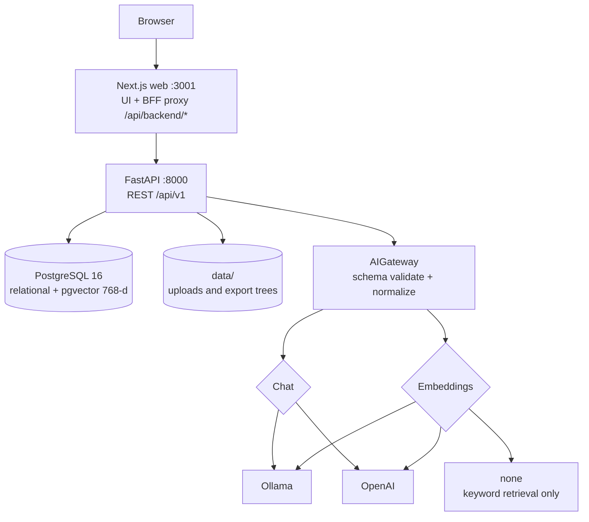
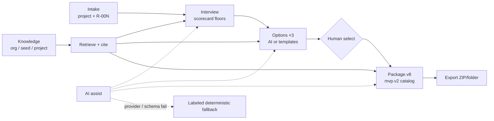

# System architecture

Archavow is a local-first **modular monolith**: one Next.js app, one FastAPI
service, and PostgreSQL (with pgvector). Module boundaries are packages inside
the API process — not separate deployables.

Companion docs: [DOMAIN_MODEL.md](./DOMAIN_MODEL.md), [AI_WORKFLOWS.md](./AI_WORKFLOWS.md),
[ARTIFACT_CATALOG.md](./ARTIFACT_CATALOG.md), [EVAL_HARNESS.md](./EVAL_HARNESS.md).

## Runtime topology

Compose binds services to loopback. Postgres is published to the host as
`127.0.0.1:5433`. Default chat is Ollama; embeddings default to `none` so the
core path works without a vector model.

### Process layout

| Process | Role |
|---------|------|
| `apps/web` | React 19 / Next.js 15 UI; server routes proxy to the API (optional Bearer → cookie session) |
| `apps/api` | FastAPI app (`app.main`); Alembic migrations on lifespan startup |
| `postgres` | Projects, interview, options, packages, exports, knowledge + embeddings |

No worker queue, SSE job bus, or separate review service in MVP.

## Logical workflow

Lifecycle stages (derived, not a stored state machine):  
`intake` → `interview` → `options` → `package` → `export`.

Human gates: submit edited interview answers (not verbatim suggestion templates);
select exactly one architecture option before package generate.

## API modules

Routers mounted under `/api/v1` (`app.main`):

| Module | Responsibility |
|--------|----------------|
| `projects` | CRUD, derived lifecycle, dashboard aggregation |
| `requirements` | Intake requirements, clarification questions, gap analysis, completeness scorecard, answer checks |
| `options` | Generate three alternatives (lock + replace), select one, generate package via `package_builders` |
| `knowledge` | Upload/chunk, seed library, keyword/semantic search, ask with `grounded` flag |
| `export` | Build file tree from package (`packager.py`), list/download ZIP or folder |
| `settings` | Workspace AI overrides, provider probes |
| `ai` | Provider registry, `AIGateway`, strict JSON Schema adapt/normalize, `AiAssistStatus` |

Package builders (not a separate router) assemble catalog artifacts: documents,
Mermaid, ADRs, risks, threats, architecture backlog, delivery epics, evidence
checklist, citations, provenance (`workflow_version=package.v8`,
`artifact_catalog=mvp.v2`).

Web package UI browses **one artifact at a time** (`?a=<id>`) in catalog order
(`apps/web/lib/artifacts.ts`).

## Evidence and provenance

Archavow keeps these distinguishable:

| Kind | How it appears |
|------|----------------|
| Intake requirements | `Requirement.source=intake` → stable `R-00N` |
| Interview answers | `interview:<code>` evidence; do **not** become delivery stories |
| Suggestion prompts | Editable drafts; verbatim submit rejected |
| Org / project knowledge | Citations preferred; seed labeled industry |
| AI drafts | Schema-validated; origin `ai` where persisted |
| Deterministic templates | `origin=template` when chat/schema fails |
| Baseline enablers | `origin=baseline_recommendation` on delivery backlog |

Evidence checklist (`quality_score`) uses coverage states  
`missing` → `partial` → `evidenced` → `verified` — never a fake 0–100 score.
Keyword presence alone never reaches `verified`; interview floors can.
Option cost/ops bands do not buy coverage; stack claims without intake alignment
add gap notes.

Knowledge ask: KB hit → `grounded=true` + citations; model/web fallback →
`grounded=false` and citations cleared (UI warns).

## AI gateway

Sole call site for feature modules — never provider SDKs from domain code.

| Concern | Rule |
|---------|------|
| Chat | `ollama` \| `openai` |
| Embeddings | `ollama` \| `openai` \| `none` (independent of chat) |
| Structured output | Wire adapt for strict providers; validate against **original** schema; drop optional nulls before return |
| Failures | `AI_PROVIDER_ERRORS` → assist `failed` / labeled fallback; other exceptions re-raise |
| Secrets | `OPENAI_API_KEY` server-side only; never in Settings GET/PATCH or DB |
| Vectors | Fixed **768** dims; keyword path when embeddings disabled |

## Data and storage

PostgreSQL holds first-class rows for projects, requirements, questions, options,
packages, export runs, knowledge documents/chunks, and workspace settings.
Most package architecture content is **JSON/text on `ArchitecturePackage`**
(see [DOMAIN_MODEL.md](./DOMAIN_MODEL.md)).

Legacy tables `artifacts` / `review_runs` / `review_findings` remain in schema
but are outside the product path. Architecture review of record is the human
sign-off stub in `documents.review_record`.

Local `data/` holds upload and export material. `graphify-out/`, `.next/`, and
seeded `/knowledge/` trees are gitignored.

## Trust boundaries

- Optional `ARCHAVOW_API_KEY`: Bearer on `/api/v1`; browser unlock → HTTP-only session
- `/health` is public
- Provider credentials stay on the API host
- Single-organization local tool — not SSO, multi-tenant RBAC, or collaborative editing

## Reliability and concurrency

- Option generation locks the project row; old options stay until a full set of three is ready
- Unexpected AI/programming errors do not surface as a successful template set
- Package generate is synchronous in-request (no Job entity)
- Lifespan runs Alembic upgrade; health reports DB/schema degradation
- Postgres CI covers migrations, pgvector, and locking (`make test-api-postgres`)

## Validation

CI (`.github/workflows/ci.yml`):

1. SQLite pytest  
2. PostgreSQL + Alembic + pgvector pytest  
3. Web `tsc --noEmit` + Vitest  

Deterministic golden cases and coverage map: [EVAL_HARNESS.md](./EVAL_HARNESS.md).
Workflow behavior: [AI_WORKFLOWS.md](./AI_WORKFLOWS.md). Demo path: [DEMO.md](./DEMO.md).
